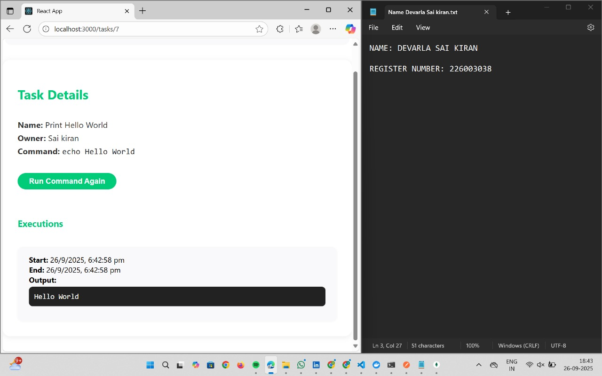

# Kaiburr Task 3 Frontend

**Author:** Devarla Sai Kiran  
**Date:** Friday, September 26, 2025

This project is a React-based frontend for managing shell command tasks and their executions. Users can create, search, delete, and run tasks, with all data managed via a REST API backend.

## Setup Instructions

1. **Prerequisites:**
   - Node.js (v16 or higher recommended)
   - npm (comes with Node.js)
   - Backend API running (see Task 1)

2. **Clone the repository:**
    git clone https://github.com/Devarla-Sai-kiran/kaiburr-task3-web-ui.git

3. **Install dependencies:**
    npm install

4. **Configure API endpoint (if needed):**
    - If your backend is not running on `http://localhost:8080`, update the API URL in your frontend code (usually in a `.env` file or a config file).

5. **Start the frontend app:**
    npm start
    
    - The app will open in your browser at [http://localhost:3000](http://localhost:3000) by default.

## Screenshots

### Home Page

### All Tasks

### Creating New Task

### Validating Commands

### View a Task

### Deleting a Task

### Running a Command

### Searching a Task

## Demo Video
[Watch the demo video on Google Drive](https://drive.google.com/file/d/1Q4evDGCwjxVAtaeE9hfKNZtW3dwKv-3Q/view?usp=drive_link)

